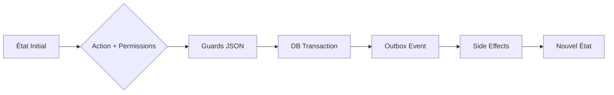

#  TransLog Pro v1.0


[](https://github.com/votre-repo)
[](https://github.com/votre-repo)
[](https://github.com/votre-repo)

**TransLog Pro** est une plateforme SaaS multi-tenant de nouvelle génération dédiée à la digitalisation intégrale de la chaîne de valeur du transport (passagers et logistique). 

> **Principe fondamental :** Aucun état métier n'est modifié directement. Toute mutation est orchestrée par un **Unified Workflow Engine (UWE)** stateless et event-driven.

---

## 🚀 Vision & Capacités

TransLog Pro couvre l'intégralité des besoins opérationnels des transporteurs modernes :
* **Billetterie & Passagers :** Réservation multicanal, QR codes HMAC sécurisés, et gestion du Yield Management.
* **Messagerie Colis :** Tracking scan-by-scan, gestion des groupages (*Shipments*) et SAV intégré.
* **Flight Deck (Sécurité) :** Checklists obligatoires (pré-départ/arrivée) et bouton SOS prioritaire.
* **Gestion de Flotte :** Maintenance prédictive, plans de salle (SeatMaps) dynamiques et suivi GPS.
* **Finance :** Caisse terrain avec audit immuable et paiements Mobile Money (Flutterwave/Paystack).

---

## 🛠 Stack Technique & Architecture

L'architecture est conçue pour l'isolation totale des données et la portabilité des services.

### Core Stack
| Couche | Technologie |
| :--- | :--- |
| **Backend** | NestJS (Modular Monolith, prêt pour microservices) |
| **Frontend** | Next.js (Admin) & React Native (Apps Agents/Chauffeurs) |
| **Data** | PostgreSQL 16 (RLS Restrictive) & Prisma ORM |
| **Sécurité** | HashiCorp Vault (Gestion des secrets & PKI) |
| **Events** | Transactional Outbox (PostgreSQL) + Redis Pub/Sub |

### Isolation Multi-Tenant (RLS)
Le système utilise des politiques **PostgreSQL RLS (Row Level Security)** strictes. 
* **Niveau DB :** Si `app.tenant_id` n'est pas défini, aucune ligne n'est retournée.
* **Niveau App :** Le `tenantId` est injecté uniquement via la session sécurisée (Better Auth).

---

## ⚙️ Unified Workflow Engine (UWE)

Le cœur du système repose sur une machine à états configurable par tenant.



### Exemples de Workflows
1.  **Ticket :** `RESERVED` → `PAY` → `CONFIRMED` → `BOARDED`.
2.  **Colis :** `CREATED` → `RECEIVED` → `IN_TRANSIT` → `DELIVERED`.
3.  **Bus :** `IDLE` → `MAINTENANCE` → `AVAILABLE`.

---

## 🔐 Système de Permissions (IAM)

Format des permissions : `{plane}.{module}.{action}.{scope}`
* **Exemple :** `data.ticket.scan.agency` (Droit de scanner un ticket au sein de sa propre agence).
* **Plane :** `control` | `data`.
* **action :** `scan` | `create`| `update` | `pay`.
* **Scopes :** `own` | `agency` | `tenant` | `global`.

---

## 📂 Structure du Projet

2.1 Structure des Répertoires

```
src/
├── main.ts                          # Bootstrap NestJS + Vault init
├── app.module.ts                    # Root module
│
├── infrastructure/                  # Adapters (jamais importés par domain)
│   ├── database/
│   │   ├── prisma.service.ts        # PrismaClient singleton + RLS extension
│   │   ├── rls.middleware.ts        # SET LOCAL app.tenant_id par requête
│   │   ├── tenant-context.service.ts
│   │   └── database.module.ts
│   ├── secret/
│   │   ├── interfaces/
│   │   │   └── secret.interface.ts  # ISecretService
│   │   ├── vault.service.ts         # Implémentation Vault
│   │   └── secret.module.ts
│   ├── storage/
│   │   ├── interfaces/
│   │   │   └── storage.interface.ts # IStorageService
│   │   ├── minio.service.ts         # Implémentation MinIO
│   │   └── storage.module.ts
│   ├── eventbus/
│   │   ├── interfaces/
│   │   │   └── eventbus.interface.ts # IEventBus
│   │   ├── outbox.service.ts        # Écriture dans OutboxEvent
│   │   ├── outbox-poller.service.ts # Poller @Cron 1s
│   │   ├── redis-publisher.service.ts
│   │   └── eventbus.module.ts
│   └── identity/
│       ├── interfaces/
│       │   └── identity.interface.ts # IIdentityManager
│       ├── better-auth.service.ts
│       └── identity.module.ts
│
├── core/                            # Moteurs transversaux
│   ├── workflow/
│   │   ├── interfaces/
│   │   │   ├── workflow-entity.interface.ts
│   │   │   └── transition-input.interface.ts
│   │   ├── types/
│   │   │   ├── guard-definition.type.ts
│   │   │   └── side-effect-definition.type.ts
│   │   ├── workflow.engine.ts       # Moteur principal
│   │   ├── guard.evaluator.ts       # Évaluateur de Guards
│   │   ├── side-effect.dispatcher.ts
│   │   ├── audit.service.ts         # AuditLog ISO 27001
│   │   └── workflow.module.ts
│   ├── iam/
│   │   ├── types/
│   │   │   └── permission.types.ts  # PermissionString type + enums
│   │   ├── decorators/
│   │   │   └── permission.decorator.ts
│   │   ├── guards/
│   │   │   └── permission.guard.ts  # Guard global NestJS
│   │   ├── middleware/
│   │   │   └── tenant.middleware.ts
│   │   ├── services/
│   │   │   └── rbac.service.ts
│   │   └── iam.module.ts
│   ├── pricing/
│   │   ├── pricing.engine.ts
│   │   └── pricing.module.ts
│   └── security/
│       └── qr/
│           └── qr.service.ts        # HMAC-SHA256 QR generation/verification
│
├── modules/                         # Domain modules
│   ├── tenant/
│   │   ├── dto/
│   │   │   ├── create-tenant.dto.ts
│   │   │   └── install-module.dto.ts
│   │   ├── tenant.controller.ts
│   │   ├── tenant.service.ts
│   │   └── tenant.module.ts
│   ├── ticketing/
│   │   ├── dto/
│   │   │   ├── create-ticket.dto.ts
│   │   │   └── verify-qr.dto.ts
│   │   ├── ticketing.controller.ts
│   │   ├── ticketing.service.ts
│   │   └── ticketing.module.ts
│   ├── parcel/
│   │   ├── dto/
│   │   │   ├── create-parcel.dto.ts
│   │   │   └── create-shipment.dto.ts
│   │   ├── parcel.controller.ts
│   │   ├── parcel.service.ts
│   │   ├── shipment.service.ts
│   │   └── parcel.module.ts
│   ├── fleet/
│   │   ├── dto/
│   │   │   ├── create-bus.dto.ts
│   │   │   └── create-staff.dto.ts
│   │   ├── fleet.controller.ts
│   │   ├── fleet.service.ts
│   │   └── fleet.module.ts
│   ├── trip/
│   │   ├── dto/
│   │   │   └── create-trip.dto.ts
│   │   ├── trip.controller.ts
│   │   ├── trip.service.ts
│   │   └── trip.module.ts
│   ├── cashier/
│   │   ├── dto/
│   │   │   └── open-register.dto.ts
│   │   ├── cashier.controller.ts
│   │   ├── cashier.service.ts
│   │   └── cashier.module.ts
│   ├── tracking/
│   │   ├── tracking.controller.ts
│   │   ├── tracking.service.ts
│   │   └── tracking.module.ts
│   ├── manifest/
│   │   ├── manifest.controller.ts
│   │   ├── manifest.service.ts
│   │   └── manifest.module.ts
│   ├── flight-deck/
│   │   ├── dto/
│   │   │   ├── submit-checklist.dto.ts
│   │   │   └── report-incident.dto.ts
│   │   ├── flight-deck.controller.ts
│   │   ├── flight-deck.service.ts
│   │   └── flight-deck.module.ts
│   ├── garage/
│   │   ├── dto/
│   │   │   └── create-maintenance-report.dto.ts
│   │   ├── garage.controller.ts
│   │   ├── garage.service.ts
│   │   └── garage.module.ts
│   ├── sav/
│   │   ├── dto/
│   │   │   └── create-claim.dto.ts
│   │   ├── sav.controller.ts
│   │   ├── sav.service.ts
│   │   └── sav.module.ts
│   ├── notification/
│   │   ├── handlers/
│   │   │   ├── parcel-notification.handler.ts
│   │   │   ├── trip-notification.handler.ts
│   │   │   └── sav-notification.handler.ts
│   │   ├── notification.service.ts
│   │   └── notification.module.ts
│   ├── display/
│   │   ├── display.controller.ts
│   │   ├── display.gateway.ts       # Socket.io WebSocket Gateway
│   │   └── display.module.ts
│   └── analytics/
│       ├── analytics.controller.ts
│       ├── analytics.service.ts
│       └── analytics.module.ts
│
└── common/
    ├── constants/
    │   ├── workflow-states.ts       # Enums d'états par entité
    │   └── permissions.ts           # Toutes les permissions string
    ├── types/
    │   ├── domain-event.type.ts     # DomainEvent interface
    │   └── api-response.type.ts     # Response envelopes
    ├── decorators/
    │   ├── tenant-id.decorator.ts   # @TenantId() param decorator
    │   └── current-user.decorator.ts # @CurrentUser()
    ├── filters/
    │   └── http-exception.filter.ts # RFC 7807
    └── interceptors/
        ├── request-id.interceptor.ts
        └── logging.interceptor.ts
```

### 2.2 Responsabilités par Module

| Module | Propriétaire | Publie | Consomme |
|---|---|---|---|
| `core/iam` | User, Role, Permission, Session, Agency | — | — |
| `core/workflow` | WorkflowConfig, WorkflowTransition, AuditLog | Tous events via IEventBus | — |
| `core/pricing` | PricingRules | — | InstalledModule |
| `modules/tenant` | Tenant, InstalledModule | `tenant.provisioned` | — |
| `modules/ticketing` | Ticket, Traveler, Baggage | Via WorkflowEngine | `trip.boarding_started`, `trip.completed` |
| `modules/parcel` | Parcel, Shipment | Via WorkflowEngine | `trip.departed` |
| `modules/fleet` | Bus, Staff, Route, Waypoint, Station | `bus.status_changed` | `incident.mechanical` |
| `modules/trip` | Trip | Via WorkflowEngine | `checklist.pre_departure.compliant` |
| `modules/cashier` | CashRegister, Transaction | `cashregister.opened/closed` | — |
| `modules/tracking` | — (lit Trip.lat/lng) | `gps.updated` → Redis direct | — |
| `modules/manifest` | — (agrégation) | — | `ticket.boarded`, `parcel.loaded` |
| `modules/flight-deck` | Checklist, Incident | `checklist.*.compliant`, `incident.*` | `trip.arrived` |
| `modules/garage` | MaintenanceReport | `maintenance.approved` | `incident.mechanical` |
| `modules/sav` | LostFoundItem, Claim | `sav.*` | `incident.lost_object`, `parcel.damaged` |
| `modules/notification` | NotificationPreference | — | Tous events domain |
| `modules/display` | — (read-only) | — | `trip.*` → Redis → WebSocket |
| `modules/analytics` | — (read-only agrégée) | — | — |

---


---

## 🛠 Installation (Développement)

1. **Pré-requis :** Docker, Node.js v20+, PNPM.
2. **Cloner le repo :** `git clone ...`
3. **Lancer l'infra :** `docker-compose up -d`
4. **Init Vault :** `pnpm run vault:init`
5. **Lancer le backend :** `pnpm run dev:api`

---

## 📝 Historique des Révisions (v2.0)
* Formalisation du schéma **WorkflowConfig**.
* Ajout du module **Maintenance & Garage**.
* Sécurisation des QR Codes via **HMAC-SHA256**.
* Implémentation de la **Transactional Outbox** pour la fiabilité des événements.

---
© 2026 TransLog Pro. Document de Référence (Single Source of Truth).
